# Prisma Scan

**Document Scanner &amp; PDF Studio** — scan with auto edge-detection, clean up
pages with magic filters, then read, edit, sign and share as PDF. Built in
Flutter with a holographic-glassmorphism UI.

> Scan · Create · Sign

## Screenshots

Running on iOS with demo data.

| Home | Reader | Editor | Files |
|:---:|:---:|:---:|:---:|
| 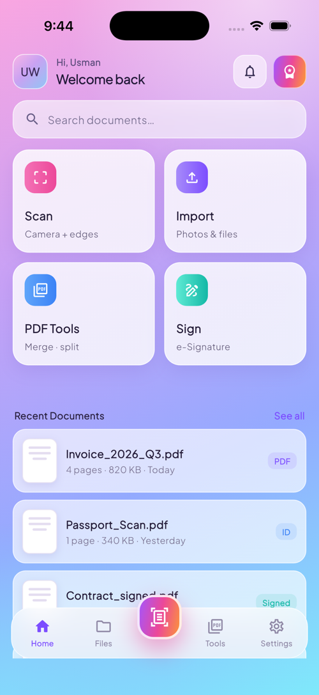 | 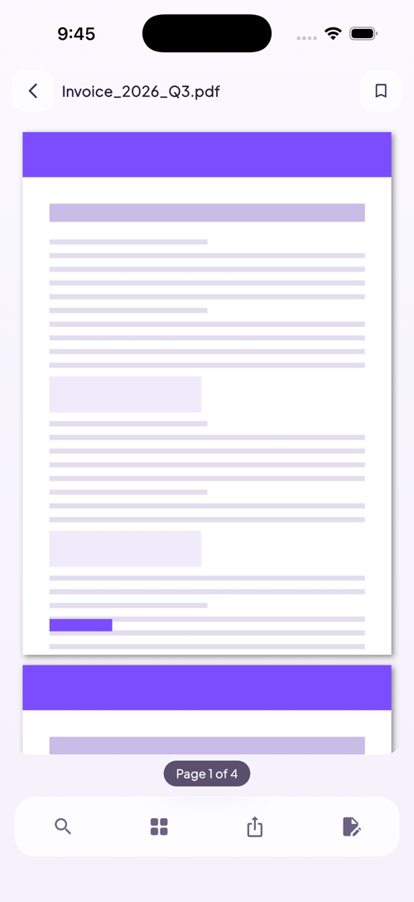 | 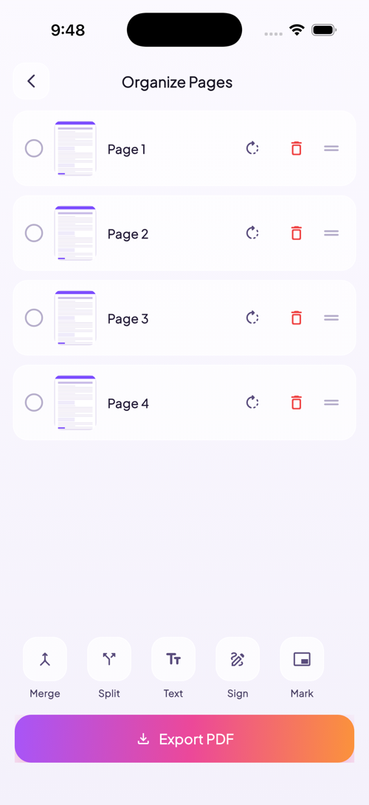 | 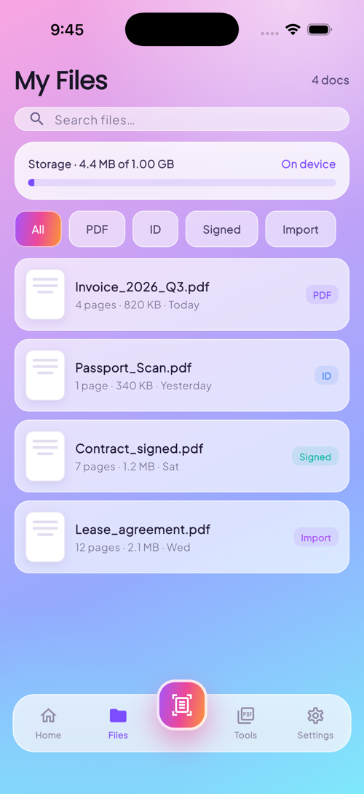 |
| **Home** — quick actions & recent docs | **Reader** — pinch-zoom, thumbnails, share | **Editor** — reorder, merge, split, watermark | **Files** — search, storage, filters |

| PDF Tools | Settings | Pro Paywall | |
|:---:|:---:|:---:|:---:|
| 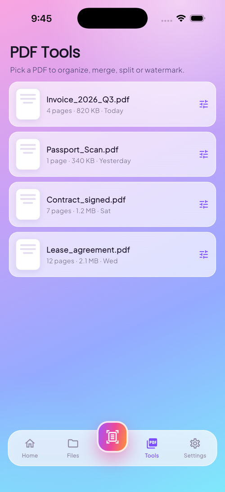 | 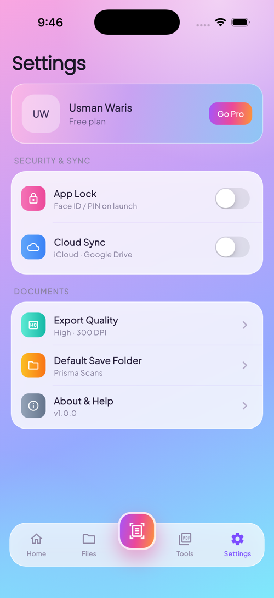 | 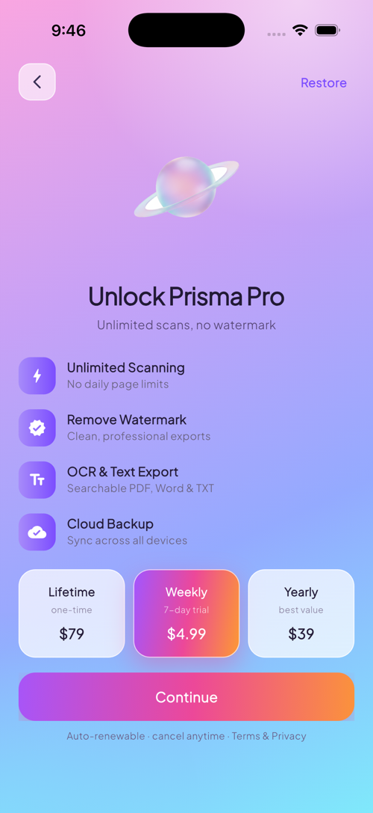 | |
| **Tools** — pick a PDF to edit | **Settings** — app lock, sync, quality | **Pro** — plans & feature list | |

### On a real device

Native document scanning, real signature capture, and the final signed PDF — running on a physical phone.

| Splash | Scanner (live) | Edit & Enhance | Sign | Signed PDF |
|:---:|:---:|:---:|:---:|:---:|
| 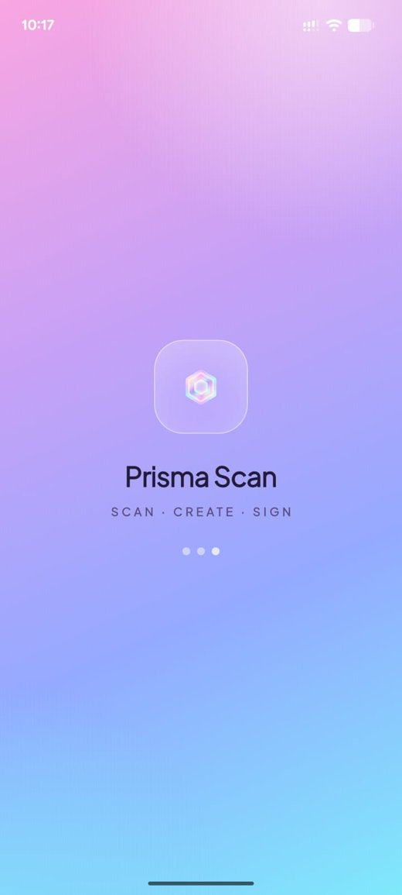 | 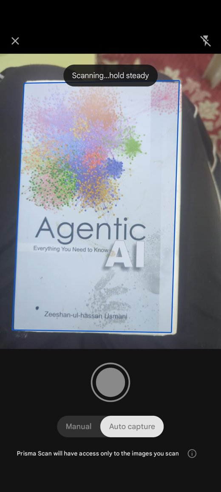 | 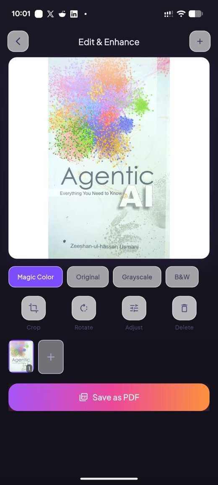 | 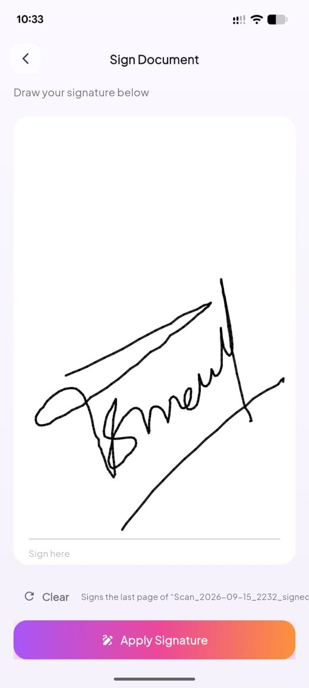 | 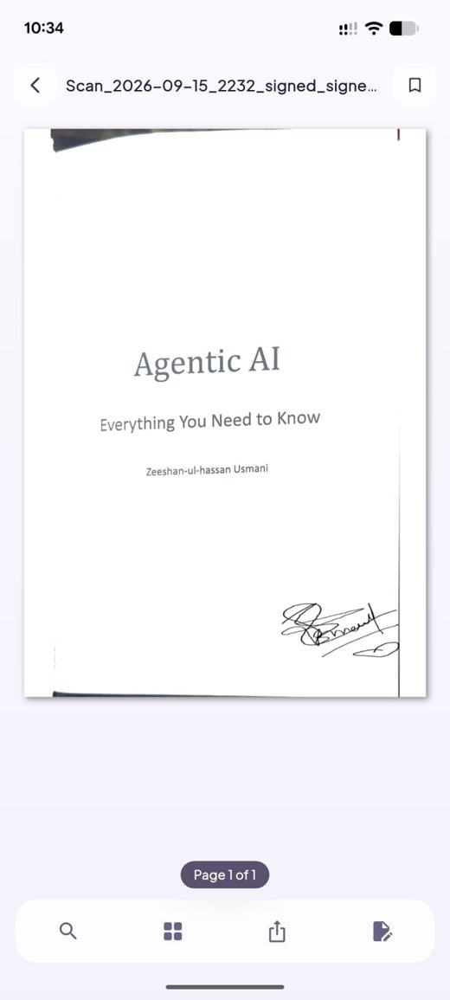 |
| Brand splash | Auto edge-detection on a real book | Magic-color filter + pages | Finger-drawn signature | Signature stamped onto the PDF |

## Status

Built in phases — see [`docs/PHASES.md`](docs/PHASES.md).

- ✅ **Phase 1 — Foundation &amp; Splash**: theme system, glass/gradient widgets, routing, splash screen.
- ✅ **Phase 2 — Home &amp; Navigation**: full home, glass bottom nav + scan FAB, document model & Riverpod providers.
- ✅ **Phase 3 — Scanner &amp; Edit**: native edge-detection scan, magic-color/grayscale/B&W filters, multi-page, PDF export.
- ✅ **Phase 4 — PDF Reader**: pinch-zoom pager, page thumbnails, bookmark & share.
- ✅ **Phase 5 — PDF Editor**: reorder/rotate/delete pages, merge, split, watermark, export (Syncfusion).
- ✅ **Phase 6 — Files**: document library with search, storage meter, filter segments, rename/share/delete.
- ✅ **Phase 7 — Settings &amp; Paywall**: persisted settings (app lock, cloud sync, export quality) and the Prisma Pro paywall (RevenueCat-ready).

**All 7 phases complete** — the full app flow works end to end.

## Design

- Interactive concept: [`docs/design/prisma-scan-mockup.html`](docs/design/prisma-scan-mockup.html) (open in a browser).
- Image asset prompts: [`docs/IMAGE_PROMPTS.md`](docs/IMAGE_PROMPTS.md).

## Tech stack

| Area | Choice |
|------|--------|
| Framework | Flutter (Dart) |
| State | Riverpod |
| Routing | go_router |
| Typography | google_fonts — Poppins + Plus Jakarta Sans |
| Scanner | cunning_document_scanner *(Phase 3)* |
| PDF | pdfx / syncfusion *(Phase 4–5)* |

## Getting started

```bash
flutter pub get
flutter run
```

Requires Flutter 3.4+ and a configured iOS/Android toolchain.

## Project structure

```
lib/
  main.dart          # entry (ProviderScope)
  app.dart           # MaterialApp.router + themes
  core/theme/        # colors, gradients, ThemeData
  core/router/       # go_router table
  shared/widgets/    # HoloBackground, GlassCard, GradientButton, ...
  features/          # splash, home, (scanner, reader, editor, files, settings ...)
docs/                # phase docs, image prompts, design mockup
```

## License

Proprietary — all rights reserved (update as needed).
